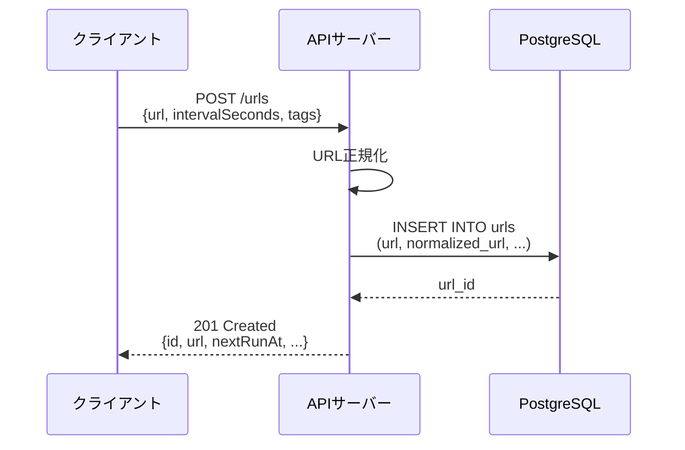
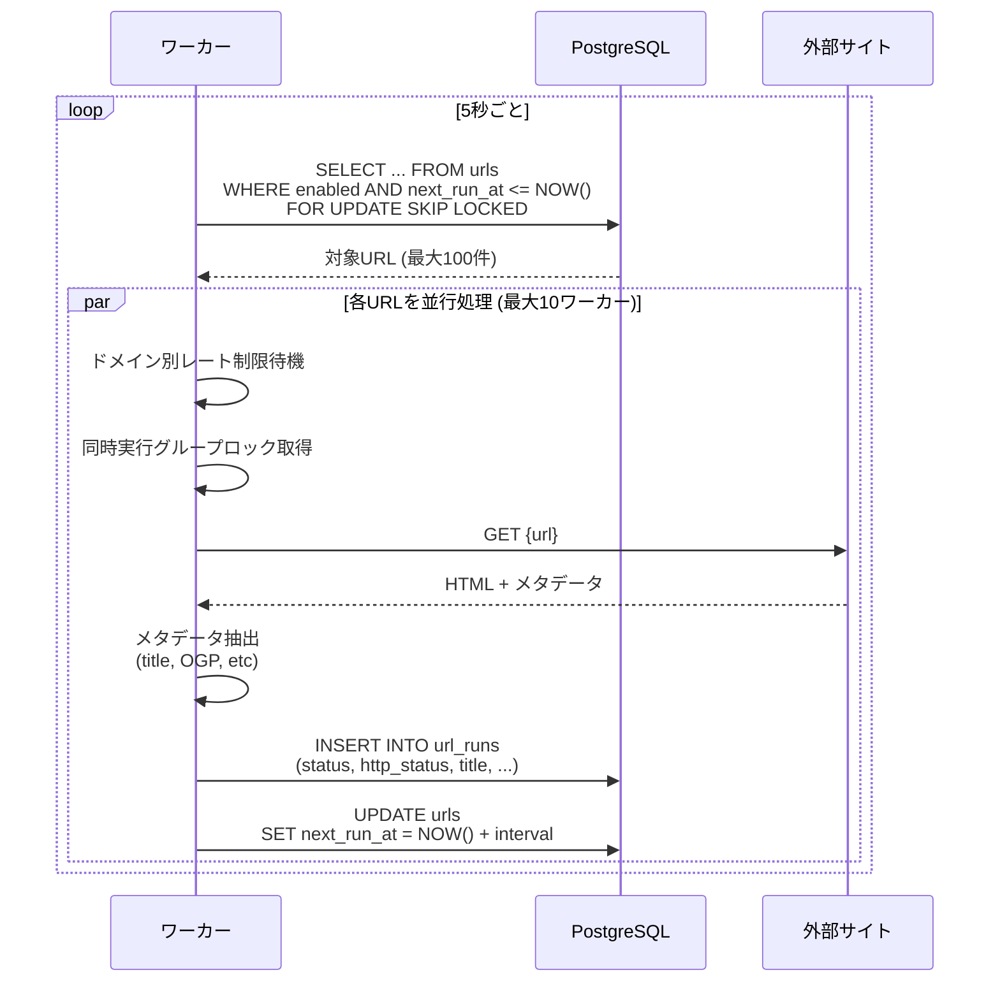
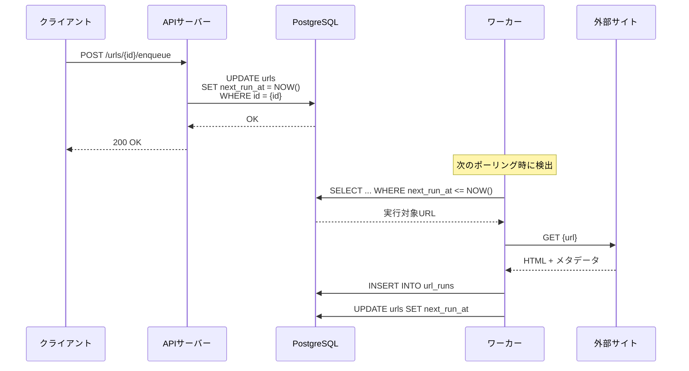
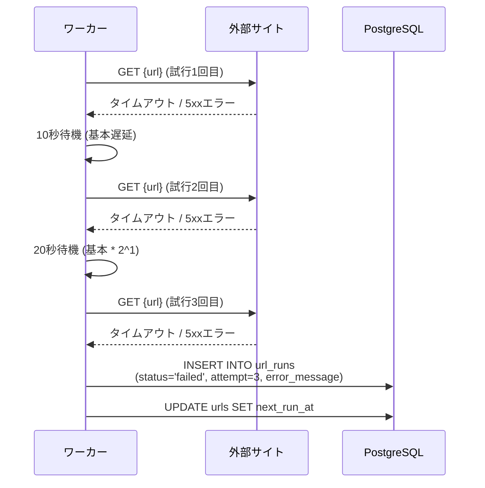

# URL Metadata Collector

URLメタデータ収集基盤 - 指定したURLのタイトル、OGP、HTTPステータスなどを定期的に収集するシステム。
## アーキテクチャ

```
┌─────────────┐     ┌─────────────┐     ┌─────────────┐
│ API Server  │     │   Worker    │     │ PostgreSQL  │
│   :8080     │────▶│ (Scheduler) │────▶│   :5432     │
└─────────────┘     └──────┬──────┘     └─────────────┘
                           │
                           ▼
                    ┌─────────────┐
                    │ External    │
                    │ URLs        │
                    └─────────────┘
```

### コンポーネント

- **API Server** (`cmd/api`): URL管理と結果参照のREST API
- **Worker** (`cmd/worker`): 定期収集を行うバックグラウンドプロセス
- **PostgreSQL**: URLマスタと収集結果を永続化

## 実行フロー

### URL登録フロー



### 定期収集フロー（自動実行）



### 手動実行フロー



### リトライフロー



## 起動方法

### Docker Composeで起動

```bash
# 起動
docker compose up -d

# ログ確認
docker compose logs -f

# 停止
docker compose down
```

### API実行例

```bash
# URL登録
curl -X POST http://localhost:8080/urls \
  -H "Content-Type: application/json" \
  -d '{
    "url": "https://example.com",
    "intervalSeconds": 300,
    "tags": ["test"]
  }'

# URL一覧
curl http://localhost:8080/urls

# 手動実行（即時収集）
curl -X POST http://localhost:8080/urls/1/enqueue

# 最新結果確認
curl http://localhost:8080/urls/1/latest

# 収集履歴
curl http://localhost:8080/urls/1/runs
```

## API仕様

### エンドポイント一覧

| メソッド | パス                 | 説明           |
| -------- | -------------------- | -------------- |
| POST     | `/urls`              | URL登録        |
| GET      | `/urls`              | URL一覧取得    |
| GET      | `/urls/{id}`         | URL詳細取得    |
| PATCH    | `/urls/{id}`         | URL更新        |
| DELETE   | `/urls/{id}`         | URL削除        |
| GET      | `/urls/{id}/latest`  | 最新収集結果   |
| GET      | `/urls/{id}/runs`    | 収集履歴       |
| POST     | `/urls/{id}/enqueue` | 手動実行       |
| GET      | `/health`            | ヘルスチェック |

### URL登録リクエスト

```json
{
  "url": "https://example.com/page",
  "intervalSeconds": 3600,
  "tags": ["recruitment", "engineering"],
  "enabled": true,
  "maxConcurrencyGroup": "example.com"
}
```

### 収集結果レスポンス

```json
{
  "data": {
    "id": 1,
    "urlId": 1,
    "status": "succeeded",
    "httpStatus": 200,
    "finalUrl": "https://example.com/page/",
    "contentType": "text/html; charset=utf-8",
    "latencyMs": 245,
    "title": "Example Page Title",
    "description": "This is the meta description",
    "ogTitle": "Example OG Title",
    "ogDescription": "This is the OG description",
    "ogImage": "https://example.com/og-image.png",
    "ogUrl": "https://example.com/page",
    "ogSiteName": "Example Site",
    "attempt": 1,
    "runAt": "2024-01-15T10:05:00Z"
  }
}
```

## 環境変数

| 変数                        | デフォルト | 説明                             |
| --------------------------- | ---------- | -------------------------------- |
| `DATABASE_URL`              | -          | PostgreSQL接続文字列             |
| `API_PORT`                  | 8080       | APIサーバポート                  |
| `MAX_WORKERS`               | 10         | 最大同時実行Worker数             |
| `RATE_LIMIT_PER_SEC`        | 5          | 秒間リクエスト上限（グローバル） |
| `DOMAIN_RATE_LIMIT_PER_SEC` | 2          | ドメイン別秒間リクエスト上限     |
| `REQUEST_TIMEOUT`           | 8s         | HTTPリクエストタイムアウト       |
| `MAX_RETRY_ATTEMPTS`        | 3          | 最大リトライ回数                 |
| `RETRY_BASE_DELAY`          | 10s        | リトライ基本待機時間             |
| `POLL_INTERVAL`             | 5s         | スケジューラポーリング間隔       |
| `BATCH_SIZE`                | 100        | 1回のポーリングで取得するURL数   |


## 設計判断

### 排他制御（並行制御）

- 方式A: `SELECT ... FOR UPDATE SKIP LOCKED` を使用し、複数Workerインスタンスでも安全に並行処理可能。
- 方式B: 別テーブルでlease/lockレコードを管理する方式
方式Aを採用した理由:
- 既存の`urls`テーブルと`next_run_at`カラムのみで並行制御が完結
  - 追加のテーブル不要
  - lease期限切れの処理やクリーンアップ処理が不要
  - コード量が少なく保守が容易
- `FOR UPDATE SKIP LOCKED`は並行処理のために設計された機能
  - データベースレベルで排他制御が保証される
  - アプリケーション側の複雑なロジック不要
  - デッドロックやタイムアウトのリスクが低い

- 障害時の復旧が容易
  - Workerが異常終了しても`next_run_at`が残るだけで、次回ポーリング時に再実行される
  - leaseテーブル方式では期限切れレコードの削除や、orphan leaseの検出・クリーンアップが必要

- 1回のクエリで対象URLを取得・ロック
  - 方式Bでは「対象検索 → leaseレコード作成 → URL取得」と複数のクエリが必要
  - トランザクションがシンプルで高速

### リトライ戦略

- 対象: タイムアウト、一時的ネットワークエラー、5xx
- 非対象: SSRFブロック、4xx
- バックオフ: `base * 2^(attempt-1)`（例: 10s→20s→40s）

### SSRF対策

1. スキーム検証（http/httpsのみ）
2. ホスト検証（プライベートIP/localhost拒否）
3. DNS解決後のIP検証
4. リダイレクト先の再検証

ブロック対象:

- `127.0.0.0/8` (ループバック)
- `10.0.0.0/8`, `172.16.0.0/12`, `192.168.0.0/16` (プライベート)
- `169.254.0.0/16` (リンクローカル/AWSメタデータ)

### ドメイン別レート制限

各ドメインに対して個別にレート制限を適用（デフォルト: 2件/秒）。同一ドメインへの過度な負荷を防ぎつつ、異なるドメインは並行処理可能。

**robots.txtではなくドメイン別レート制限を採用した理由:**

- robots.txt対応には以下が必要となり、コア機能に対して複雑度が高い
  - robots.txtのパーサー実装
  - キャッシュ機構（有効期限管理）
  - 定期的な再取得とキャッシュ更新
  - パースエラーやネットワークエラーのハンドリング
- ドメイン別レート制限は外部要因に依存せず、システム側で確実に負荷を制御できる
  - robots.txtは対象サイトが提供していない場合や、更新が遅れた場合に機能しない
  - レート制限は常に一定の保護を提供
- グローバルレート制限（5件/秒）とドメイン別レート制限（2件/秒）の組み合わせにより、外部サイトへの過度な負荷を十分に防止できる

### 同時実行制御

`maxConcurrencyGroup`を指定すると、同一グループのURLは完全に直列実行され、より厳格な負荷軽減が可能。

## 開発ガイド

### プロジェクト構造

```
.
├── cmd/
│   ├── api/           # APIサーバエントリポイント
│   └── worker/        # ワーカーエントリポイント
├── internal/
│   ├── config/        # 設定管理
│   ├── domain/        # ドメインモデル
│   ├── handler/       # HTTPハンドラ
│   ├── httpclient/    # HTTPクライアント/SSRF対策
│   ├── observability/ # ログ
│   ├── repository/    # データアクセス
│   └── service/       # ビジネスロジック
├── migrations/        # DBマイグレーション
├── docs/              # 設計ドキュメント
├── docker-compose.yml
├── Dockerfile
└── README.md
```

## ドキュメント

詳細な設計ドキュメントは`docs/`ディレクトリを参照:

- [アーキテクチャ](docs/architecture.md)
- [API仕様](docs/api-specification.md)
- [ワーカー設計](docs/worker-design.md)
- [データベーススキーマ](docs/database-schema.md)
- [セキュリティ](docs/security.md)
- [観測性](docs/observability.md)
- [テスト戦略](docs/testing-strategy.md)
